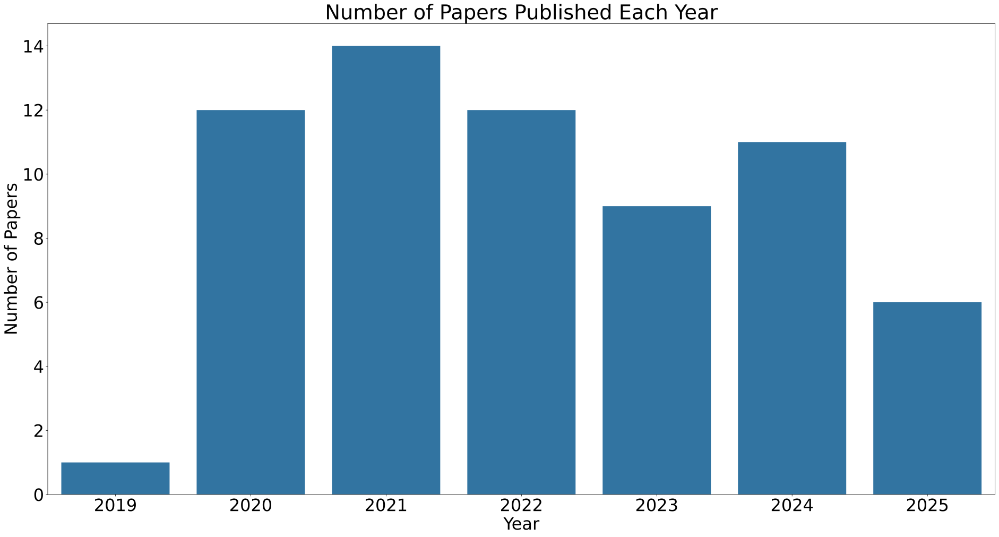
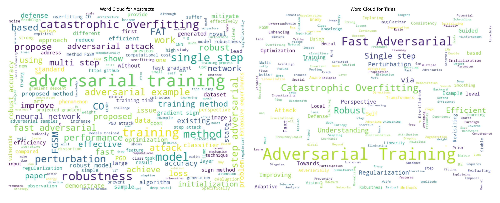

# Catastrophic Overfitting Papers
A complete list of papers on **Catastrophic Overfitting** submitted to arXiv.
You can find the papers and their titles, abstracts, authors, links, and dates stored in [this csv file](https://github.com/RamtinMoslemi/Catastrophic-Overfitting-Papers/blob/main/co_papers.csv).

## Paper Counts by Year
Number of papers submitted to arXiv by year.

## Word Clouds
Word clouds of paper titles and abstracts.

## Notebook
You can play with the notebook:

 

# 2020
## January
### [Fast is better than free: Revisiting adversarial training](https://arxiv.org/abs/2001.03994)

**Authors:**
Eric Wong, Leslie Rice, J. Zico Kolter

**Abstract:**
Adversarial training, a method for learning robust deep networks, is typically assumed to be more expensive than traditional training due to the necessity of constructing adversarial examples via a first-order method like projected gradient decent (PGD). In this paper, we make the surprising discovery that it is possible to train empirically robust models using a much weaker and cheaper adversary, an approach that was previously believed to be ineffective, rendering the method no more costly than standard training in practice. Specifically, we show that adversarial training with the fast gradient sign method (FGSM), when combined with random initialization, is as effective as PGD-based training but has significantly lower cost. Furthermore we show that FGSM adversarial training can be further accelerated by using standard techniques for efficient training of deep networks, allowing us to learn a robust CIFAR10 classifier with 45% robust accuracy to PGD attacks with $ε=8/255$ in 6 minutes, and a robust ImageNet classifier with 43% robust accuracy at $ε=2/255$ in 12 hours, in comparison to past work based on "free" adversarial training which took 10 and 50 hours to reach the same respective thresholds. Finally, we identify a failure mode referred to as "catastrophic overfitting" which may have caused previous attempts to use FGSM adversarial training to fail. All code for reproducing the experiments in this paper as well as pretrained model weights are at https://github.com/locuslab/fast_adversarial.
       

## July
### [Understanding and Improving Fast Adversarial Training](https://arxiv.org/abs/2007.02617)

**Authors:**
Maksym Andriushchenko, Nicolas Flammarion

**Abstract:**
A recent line of work focused on making adversarial training computationally efficient for deep learning models. In particular, Wong et al. (2020) showed that $\ell_\infty$-adversarial training with fast gradient sign method (FGSM) can fail due to a phenomenon called "catastrophic overfitting", when the model quickly loses its robustness over a single epoch of training. We show that adding a random step to FGSM, as proposed in Wong et al. (2020), does not prevent catastrophic overfitting, and that randomness is not important per se -- its main role being simply to reduce the magnitude of the perturbation. Moreover, we show that catastrophic overfitting is not inherent to deep and overparametrized networks, but can occur in a single-layer convolutional network with a few filters. In an extreme case, even a single filter can make the network highly non-linear locally, which is the main reason why FGSM training fails. Based on this observation, we propose a new regularization method, GradAlign, that prevents catastrophic overfitting by explicitly maximizing the gradient alignment inside the perturbation set and improves the quality of the FGSM solution. As a result, GradAlign allows to successfully apply FGSM training also for larger $\ell_\infty$-perturbations and reduce the gap to multi-step adversarial training. The code of our experiments is available at https://github.com/tml-epfl/understanding-fast-adv-training.
       

## October
### [Understanding Catastrophic Overfitting in Single-step Adversarial Training](https://arxiv.org/abs/2010.01799)

**Authors:**
Hoki Kim, Woojin Lee, Jaewook Lee

**Abstract:**
Although fast adversarial training has demonstrated both robustness and efficiency, the problem of "catastrophic overfitting" has been observed. This is a phenomenon in which, during single-step adversarial training, the robust accuracy against projected gradient descent (PGD) suddenly decreases to 0% after a few epochs, whereas the robust accuracy against fast gradient sign method (FGSM) increases to 100%. In this paper, we demonstrate that catastrophic overfitting is very closely related to the characteristic of single-step adversarial training which uses only adversarial examples with the maximum perturbation, and not all adversarial examples in the adversarial direction, which leads to decision boundary distortion and a highly curved loss surface. Based on this observation, we propose a simple method that not only prevents catastrophic overfitting, but also overrides the belief that it is difficult to prevent multi-step adversarial attacks with single-step adversarial training.
       

## December
### [Understanding and Increasing Efficiency of Frank-Wolfe Adversarial Training](https://arxiv.org/abs/2012.12368)

**Authors:**
Theodoros Tsiligkaridis, Jay Roberts

**Abstract:**
Deep neural networks are easily fooled by small perturbations known as adversarial attacks. Adversarial Training (AT) is a technique that approximately solves a robust optimization problem to minimize the worst-case loss and is widely regarded as the most effective defense. Due to the high computation time for generating strong adversarial examples in the AT process, single-step approaches have been proposed to reduce training time. However, these methods suffer from catastrophic overfitting where adversarial accuracy drops during training, and although improvements have been proposed, they increase training time and robustness is far from that of multi-step AT. We develop a theoretical framework for adversarial training with FW optimization (FW-AT) that reveals a geometric connection between the loss landscape and the $\ell_2$ distortion of $\ell_\infty$ FW attacks. We analytically show that high distortion of FW attacks is equivalent to small gradient variation along the attack path. It is then experimentally demonstrated on various deep neural network architectures that $\ell_\infty$ attacks against robust models achieve near maximal distortion, while standard networks have lower distortion. It is experimentally shown that catastrophic overfitting is strongly correlated with low distortion of FW attacks. This mathematical transparency differentiates FW from Projected Gradient Descent (PGD) optimization. To demonstrate the utility of our theoretical framework we develop FW-AT-Adapt, a novel adversarial training algorithm which uses a simple distortion measure to adapt the number of attack steps during training to increase efficiency without compromising robustness. FW-AT-Adapt provides training time on par with single-step fast AT methods and closes the gap between fast AT methods and multi-step PGD-AT with minimal loss in adversarial accuracy in white-box and black-box settings.
       

# 2021
## February
### [Robust Single-step Adversarial Training with Regularizer](https://arxiv.org/abs/2102.03381)

**Authors:**
Lehui Xie, Yaopeng Wang, Jia-Li Yin, Ximeng Liu

**Abstract:**
High cost of training time caused by multi-step adversarial example generation is a major challenge in adversarial training. Previous methods try to reduce the computational burden of adversarial training using single-step adversarial example generation schemes, which can effectively improve the efficiency but also introduce the problem of catastrophic overfitting, where the robust accuracy against Fast Gradient Sign Method (FGSM) can achieve nearby 100\% whereas the robust accuracy against Projected Gradient Descent (PGD) suddenly drops to 0\% over a single epoch. To address this problem, we propose a novel Fast Gradient Sign Method with PGD Regularization (FGSMPR) to boost the efficiency of adversarial training without catastrophic overfitting. Our core idea is that single-step adversarial training can not learn robust internal representations of FGSM and PGD adversarial examples. Therefore, we design a PGD regularization term to encourage similar embeddings of FGSM and PGD adversarial examples. The experiments demonstrate that our proposed method can train a robust deep network for L$_\infty$-perturbations with FGSM adversarial training and reduce the gap to multi-step adversarial training.
       

## March
### [ZeroGrad : Mitigating and Explaining Catastrophic Overfitting in FGSM Adversarial Training](https://arxiv.org/abs/2103.15476)

**Authors:**
Zeinab Golgooni, Mehrdad Saberi, Masih Eskandar, Mohammad Hossein Rohban

**Abstract:**
Making deep neural networks robust to small adversarial noises has recently been sought in many applications. Adversarial training through iterative projected gradient descent (PGD) has been established as one of the mainstream ideas to achieve this goal. However, PGD is computationally demanding and often prohibitive in case of large datasets and models. For this reason, single-step PGD, also known as FGSM, has recently gained interest in the field. Unfortunately, FGSM-training leads to a phenomenon called ``catastrophic overfitting," which is a sudden drop in the adversarial accuracy under the PGD attack. In this paper, we support the idea that small input gradients play a key role in this phenomenon, and hence propose to zero the input gradient elements that are small for crafting FGSM attacks. Our proposed idea, while being simple and efficient, achieves competitive adversarial accuracy on various datasets.
       

## May
### [Understanding Catastrophic Overfitting in Adversarial Training](https://arxiv.org/abs/2105.02942)

**Authors:**
Peilin Kang, Seyed-Mohsen Moosavi-Dezfooli

**Abstract:**
Recently, FGSM adversarial training is found to be able to train a robust model which is comparable to the one trained by PGD but an order of magnitude faster. However, there is a failure mode called catastrophic overfitting (CO) that the classifier loses its robustness suddenly during the training and hardly recovers by itself. In this paper, we find CO is not only limited to FGSM, but also happens in $\mbox{DF}^{\infty}$-1 adversarial training. Then, we analyze the geometric properties for both FGSM and $\mbox{DF}^{\infty}$-1 and find they have totally different decision boundaries after CO. For FGSM, a new decision boundary is generated along the direction of perturbation and makes the small perturbation more effective than the large one. While for $\mbox{DF}^{\infty}$-1, there is no new decision boundary generated along the direction of perturbation, instead the perturbation generated by $\mbox{DF}^{\infty}$-1 becomes smaller after CO and thus loses its effectiveness. We also experimentally analyze three hypotheses on potential factors causing CO. And then based on the empirical analysis, we modify the RS-FGSM by not projecting perturbation back to the $l_\infty$ ball. By this small modification, we could achieve $47.56 \pm 0.37\% $ PGD-50-10 accuracy on CIFAR10 with $ε=8/255$ in contrast to $43.57 \pm 0.30\% $ by RS-FGSM and also further extend the working range of $ε$ from 8/255 to 11/255 on CIFAR10 without CO occurring.
       

## June
### [Multi-stage Optimization based Adversarial Training](https://arxiv.org/abs/2106.15357)

**Authors:**
Xiaosen Wang, Chuanbiao Song, Liwei Wang, Kun He

**Abstract:**
In the field of adversarial robustness, there is a common practice that adopts the single-step adversarial training for quickly developing adversarially robust models. However, the single-step adversarial training is most likely to cause catastrophic overfitting, as after a few training epochs it will be hard to generate strong adversarial examples to continuously boost the adversarial robustness. In this work, we aim to avoid the catastrophic overfitting by introducing multi-step adversarial examples during the single-step adversarial training. Then, to balance the large training overhead of generating multi-step adversarial examples, we propose a Multi-stage Optimization based Adversarial Training (MOAT) method that periodically trains the model on mixed benign examples, single-step adversarial examples, and multi-step adversarial examples stage by stage. In this way, the overall training overhead is reduced significantly, meanwhile, the model could avoid catastrophic overfitting. Extensive experiments on CIFAR-10 and CIFAR-100 datasets demonstrate that under similar amount of training overhead, the proposed MOAT exhibits better robustness than either single-step or multi-step adversarial training methods.
       

## November
### [Local Linearity and Double Descent in Catastrophic Overfitting](https://arxiv.org/abs/2111.10754)

**Authors:**
Varun Sivashankar, Nikil Selvam

**Abstract:**
Catastrophic overfitting is a phenomenon observed during Adversarial Training (AT) with the Fast Gradient Sign Method (FGSM) where the test robustness steeply declines over just one epoch in the training stage. Prior work has attributed this loss in robustness to a sharp decrease in $\textit{local linearity}$ of the neural network with respect to the input space, and has demonstrated that introducing a local linearity measure as a regularization term prevents catastrophic overfitting. Using a simple neural network architecture, we experimentally demonstrate that maintaining high local linearity might be $\textit{sufficient}$ to prevent catastrophic overfitting but is not $\textit{necessary.}$ Further, inspired by Parseval networks, we introduce a regularization term to AT with FGSM to make the weight matrices of the network orthogonal and study the connection between orthogonality of the network weights and local linearity. Lastly, we identify the $\textit{double descent}$ phenomenon during the adversarial training process.
       

### [Subspace Adversarial Training](https://arxiv.org/abs/2111.12229)

**Authors:**
Tao Li, Yingwen Wu, Sizhe Chen, Kun Fang, Xiaolin Huang

**Abstract:**
Single-step adversarial training (AT) has received wide attention as it proved to be both efficient and robust. However, a serious problem of catastrophic overfitting exists, i.e., the robust accuracy against projected gradient descent (PGD) attack suddenly drops to 0% during the training. In this paper, we approach this problem from a novel perspective of optimization and firstly reveal the close link between the fast-growing gradient of each sample and overfitting, which can also be applied to understand robust overfitting in multi-step AT. To control the growth of the gradient, we propose a new AT method, Subspace Adversarial Training (Sub-AT), which constrains AT in a carefully extracted subspace. It successfully resolves both kinds of overfitting and significantly boosts the robustness. In subspace, we also allow single-step AT with larger steps and larger radius, further improving the robustness performance. As a result, we achieve state-of-the-art single-step AT performance. Without any regularization term, our single-step AT can reach over 51% robust accuracy against strong PGD-50 attack of radius 8/255 on CIFAR-10, reaching a competitive performance against standard multi-step PGD-10 AT with huge computational advantages. The code is released at https://github.com/nblt/Sub-AT.
       

## December
### [Revisiting and Advancing Fast Adversarial Training Through The Lens of Bi-Level Optimization](https://arxiv.org/abs/2112.12376)

**Authors:**
Yihua Zhang, Guanhua Zhang, Prashant Khanduri, Mingyi Hong, Shiyu Chang, Sijia Liu

**Abstract:**
Adversarial training (AT) is a widely recognized defense mechanism to gain the robustness of deep neural networks against adversarial attacks. It is built on min-max optimization (MMO), where the minimizer (i.e., defender) seeks a robust model to minimize the worst-case training loss in the presence of adversarial examples crafted by the maximizer (i.e., attacker). However, the conventional MMO method makes AT hard to scale. Thus, Fast-AT (Wong et al., 2020) and other recent algorithms attempt to simplify MMO by replacing its maximization step with the single gradient sign-based attack generation step. Although easy to implement, Fast-AT lacks theoretical guarantees, and its empirical performance is unsatisfactory due to the issue of robust catastrophic overfitting when training with strong adversaries. In this paper, we advance Fast-AT from the fresh perspective of bi-level optimization (BLO). We first show that the commonly-used Fast-AT is equivalent to using a stochastic gradient algorithm to solve a linearized BLO problem involving a sign operation. However, the discrete nature of the sign operation makes it difficult to understand the algorithm performance. Inspired by BLO, we design and analyze a new set of robust training algorithms termed Fast Bi-level AT (Fast-BAT), which effectively defends sign-based projected gradient descent (PGD) attacks without using any gradient sign method or explicit robust regularization. In practice, we show our method yields substantial robustness improvements over baselines across multiple models and datasets. Codes are available at https://github.com/OPTML-Group/Fast-BAT.
       

# 2022
## February
### [Make Some Noise: Reliable and Efficient Single-Step Adversarial Training](https://arxiv.org/abs/2202.01181)

**Authors:**
Pau de Jorge, Adel Bibi, Riccardo Volpi, Amartya Sanyal, Philip H. S. Torr, Grégory Rogez, Puneet K. Dokania

**Abstract:**
Recently, Wong et al. showed that adversarial training with single-step FGSM leads to a characteristic failure mode named Catastrophic Overfitting (CO), in which a model becomes suddenly vulnerable to multi-step attacks. Experimentally they showed that simply adding a random perturbation prior to FGSM (RS-FGSM) could prevent CO. However, Andriushchenko and Flammarion observed that RS-FGSM still leads to CO for larger perturbations, and proposed a computationally expensive regularizer (GradAlign) to avoid it. In this work, we methodically revisit the role of noise and clipping in single-step adversarial training. Contrary to previous intuitions, we find that using a stronger noise around the clean sample combined with \textit{not clipping} is highly effective in avoiding CO for large perturbation radii. We then propose Noise-FGSM (N-FGSM) that, while providing the benefits of single-step adversarial training, does not suffer from CO. Empirical analyses on a large suite of experiments show that N-FGSM is able to match or surpass the performance of previous state-of-the-art GradAlign, while achieving 3x speed-up. Code can be found in https://github.com/pdejorge/N-FGSM
       

### [Fast Adversarial Training with Noise Augmentation: A Unified Perspective on RandStart and GradAlign](https://arxiv.org/abs/2202.05488)

**Authors:**
Axi Niu, Kang Zhang, Chaoning Zhang, Chenshuang Zhang, In So Kweon, Chang D. Yoo, Yanning Zhang

**Abstract:**
PGD-based and FGSM-based are two popular adversarial training (AT) approaches for obtaining adversarially robust models. Compared with PGD-based AT, FGSM-based one is significantly faster but fails with catastrophic overfitting (CO). For mitigating CO in such Fast AT, there are two popular existing strategies: random start (RandStart) and Gradient Alignment (GradAlign). The former works only for a relatively small perturbation 8/255 with the l_\infty constraint, and GradAlign improves it by extending the perturbation size to 16/255 (with the l_\infty constraint) but at the cost of being 3 to 4 times slower. How to avoid CO in Fast AT for a large perturbation size but without increasing the computation overhead remains as an unsolved issue, for which our work provides a frustratingly simple (yet effective) solution. Specifically, our solution lies in just noise augmentation (NoiseAug) which is a non-trivial byproduct of simplifying GradAlign. By simplifying GradAlign we have two findings: (i) aligning logit instead of gradient in GradAlign requires half the training time but achieves higher performance than GradAlign; (ii) the alignment operation can also be removed by only keeping noise augmentation (NoiseAug). Simplified from GradAlign, our NoiseAug has a surprising resemblance with RandStart except that we inject noise on the image instead of perturbation. To understand why injecting noise to input prevents CO, we verify that this is caused not by data augmentation effect (inject noise on image) but by improved local linearity. We provide an intuitive explanation for why NoiseAug improves local linearity without explicit regularization. Extensive results demonstrate that our NoiseAug achieves SOTA results in FGSM AT. The code will be released after accepted.
       

## March
### [Adversarial amplitude swap towards robust image classifiers](https://arxiv.org/abs/2203.07138)

**Authors:**
Chun Yang Tan, Kazuhiko Kawamoto, Hiroshi Kera

**Abstract:**
The vulnerability of convolutional neural networks (CNNs) to image perturbations such as common corruptions and adversarial perturbations has recently been investigated from the perspective of frequency. In this study, we investigate the effect of the amplitude and phase spectra of adversarial images on the robustness of CNN classifiers. Extensive experiments revealed that the images generated by combining the amplitude spectrum of adversarial images and the phase spectrum of clean images accommodates moderate and general perturbations, and training with these images equips a CNN classifier with more general robustness, performing well under both common corruptions and adversarial perturbations. We also found that two types of overfitting (catastrophic overfitting and robust overfitting) can be circumvented by the aforementioned spectrum recombination. We believe that these results contribute to the understanding and the training of truly robust classifiers.
       

## April
### [FrequencyLowCut Pooling -- Plug & Play against Catastrophic Overfitting](https://arxiv.org/abs/2204.00491)

**Authors:**
Julia Grabinski, Steffen Jung, Janis Keuper, Margret Keuper

**Abstract:**
Over the last years, Convolutional Neural Networks (CNNs) have been the dominating neural architecture in a wide range of computer vision tasks. From an image and signal processing point of view, this success might be a bit surprising as the inherent spatial pyramid design of most CNNs is apparently violating basic signal processing laws, i.e. Sampling Theorem in their down-sampling operations. However, since poor sampling appeared not to affect model accuracy, this issue has been broadly neglected until model robustness started to receive more attention. Recent work [17] in the context of adversarial attacks and distribution shifts, showed after all, that there is a strong correlation between the vulnerability of CNNs and aliasing artifacts induced by poor down-sampling operations. This paper builds on these findings and introduces an aliasing free down-sampling operation which can easily be plugged into any CNN architecture: FrequencyLowCut pooling. Our experiments show, that in combination with simple and fast FGSM adversarial training, our hyper-parameter free operator significantly improves model robustness and avoids catastrophic overfitting.
       

## June
### [Relation Matters: Foreground-aware Graph-based Relational Reasoning for Domain Adaptive Object Detection](https://arxiv.org/abs/2206.02355)

**Authors:**
Chaoqi Chen, Jiongcheng Li, Hong-Yu Zhou, Xiaoguang Han, Yue Huang, Xinghao Ding, Yizhou Yu

**Abstract:**
Domain Adaptive Object Detection (DAOD) focuses on improving the generalization ability of object detectors via knowledge transfer. Recent advances in DAOD strive to change the emphasis of the adaptation process from global to local in virtue of fine-grained feature alignment methods. However, both the global and local alignment approaches fail to capture the topological relations among different foreground objects as the explicit dependencies and interactions between and within domains are neglected. In this case, only seeking one-vs-one alignment does not necessarily ensure the precise knowledge transfer. Moreover, conventional alignment-based approaches may be vulnerable to catastrophic overfitting regarding those less transferable regions (e.g. backgrounds) due to the accumulation of inaccurate localization results in the target domain. To remedy these issues, we first formulate DAOD as an open-set domain adaptation problem, in which the foregrounds and backgrounds are seen as the ``known classes'' and ``unknown class'' respectively. Accordingly, we propose a new and general framework for DAOD, named Foreground-aware Graph-based Relational Reasoning (FGRR), which incorporates graph structures into the detection pipeline to explicitly model the intra- and inter-domain foreground object relations on both pixel and semantic spaces, thereby endowing the DAOD model with the capability of relational reasoning beyond the popular alignment-based paradigm. The inter-domain visual and semantic correlations are hierarchically modeled via bipartite graph structures, and the intra-domain relations are encoded via graph attention mechanisms. Empirical results demonstrate that the proposed FGRR exceeds the state-of-the-art performance on four DAOD benchmarks.
       

### [Fast Adversarial Training with Adaptive Step Size](https://arxiv.org/abs/2206.02417)

**Authors:**
Zhichao Huang, Yanbo Fan, Chen Liu, Weizhong Zhang, Yong Zhang, Mathieu Salzmann, Sabine Süsstrunk, Jue Wang

**Abstract:**
While adversarial training and its variants have shown to be the most effective algorithms to defend against adversarial attacks, their extremely slow training process makes it hard to scale to large datasets like ImageNet. The key idea of recent works to accelerate adversarial training is to substitute multi-step attacks (e.g., PGD) with single-step attacks (e.g., FGSM). However, these single-step methods suffer from catastrophic overfitting, where the accuracy against PGD attack suddenly drops to nearly 0% during training, destroying the robustness of the networks. In this work, we study the phenomenon from the perspective of training instances. We show that catastrophic overfitting is instance-dependent and fitting instances with larger gradient norm is more likely to cause catastrophic overfitting. Based on our findings, we propose a simple but effective method, Adversarial Training with Adaptive Step size (ATAS). ATAS learns an instancewise adaptive step size that is inversely proportional to its gradient norm. The theoretical analysis shows that ATAS converges faster than the commonly adopted non-adaptive counterparts. Empirically, ATAS consistently mitigates catastrophic overfitting and achieves higher robust accuracy on CIFAR10, CIFAR100 and ImageNet when evaluated on various adversarial budgets.
       

### [Catastrophic overfitting can be induced with discriminative non-robust features](https://arxiv.org/abs/2206.08242)

**Authors:**
Guillermo Ortiz-Jiménez, Pau de Jorge, Amartya Sanyal, Adel Bibi, Puneet K. Dokania, Pascal Frossard, Gregory Rogéz, Philip H. S. Torr

**Abstract:**
Adversarial training (AT) is the de facto method for building robust neural networks, but it can be computationally expensive. To mitigate this, fast single-step attacks can be used, but this may lead to catastrophic overfitting (CO). This phenomenon appears when networks gain non-trivial robustness during the first stages of AT, but then reach a breaking point where they become vulnerable in just a few iterations. The mechanisms that lead to this failure mode are still poorly understood. In this work, we study the onset of CO in single-step AT methods through controlled modifications of typical datasets of natural images. In particular, we show that CO can be induced at much smaller $ε$ values than it was observed before just by injecting images with seemingly innocuous features. These features aid non-robust classification but are not enough to achieve robustness on their own. Through extensive experiments we analyze this novel phenomenon and discover that the presence of these easy features induces a learning shortcut that leads to CO. Our findings provide new insights into the mechanisms of CO and improve our understanding of the dynamics of AT. The code to reproduce our experiments can be found at https://github.com/gortizji/co_features.
       

## July
### [Prior-Guided Adversarial Initialization for Fast Adversarial Training](https://arxiv.org/abs/2207.08859)

**Authors:**
Xiaojun Jia, Yong Zhang, Xingxing Wei, Baoyuan Wu, Ke Ma, Jue Wang, Xiaochun Cao

**Abstract:**
Fast adversarial training (FAT) effectively improves the efficiency of standard adversarial training (SAT). However, initial FAT encounters catastrophic overfitting, i.e.,the robust accuracy against adversarial attacks suddenly and dramatically decreases. Though several FAT variants spare no effort to prevent overfitting, they sacrifice much calculation cost. In this paper, we explore the difference between the training processes of SAT and FAT and observe that the attack success rate of adversarial examples (AEs) of FAT gets worse gradually in the late training stage, resulting in overfitting. The AEs are generated by the fast gradient sign method (FGSM) with a zero or random initialization. Based on the observation, we propose a prior-guided FGSM initialization method to avoid overfitting after investigating several initialization strategies, improving the quality of the AEs during the whole training process. The initialization is formed by leveraging historically generated AEs without additional calculation cost. We further provide a theoretical analysis for the proposed initialization method. We also propose a simple yet effective regularizer based on the prior-guided initialization,i.e., the currently generated perturbation should not deviate too much from the prior-guided initialization. The regularizer adopts both historical and current adversarial perturbations to guide the model learning. Evaluations on four datasets demonstrate that the proposed method can prevent catastrophic overfitting and outperform state-of-the-art FAT methods. The code is released at https://github.com/jiaxiaojunQAQ/FGSM-PGI.
       

## September
### [Bag of Tricks for FGSM Adversarial Training](https://arxiv.org/abs/2209.02684)

**Authors:**
Zichao Li, Li Liu, Zeyu Wang, Yuyin Zhou, Cihang Xie

**Abstract:**
Adversarial training (AT) with samples generated by Fast Gradient Sign Method (FGSM), also known as FGSM-AT, is a computationally simple method to train robust networks. However, during its training procedure, an unstable mode of "catastrophic overfitting" has been identified in arXiv:2001.03994 [cs.LG], where the robust accuracy abruptly drops to zero within a single training step. Existing methods use gradient regularizers or random initialization tricks to attenuate this issue, whereas they either take high computational cost or lead to lower robust accuracy. In this work, we provide the first study, which thoroughly examines a collection of tricks from three perspectives: Data Initialization, Network Structure, and Optimization, to overcome the catastrophic overfitting in FGSM-AT.
  Surprisingly, we find that simple tricks, i.e., a) masking partial pixels (even without randomness), b) setting a large convolution stride and smooth activation functions, or c) regularizing the weights of the first convolutional layer, can effectively tackle the overfitting issue. Extensive results on a range of network architectures validate the effectiveness of each proposed trick, and the combinations of tricks are also investigated. For example, trained with PreActResNet-18 on CIFAR-10, our method attains 49.8% accuracy against PGD-50 attacker and 46.4% accuracy against AutoAttack, demonstrating that pure FGSM-AT is capable of enabling robust learners. The code and models are publicly available at https://github.com/UCSC-VLAA/Bag-of-Tricks-for-FGSM-AT.
       

## October
### [Stable and Efficient Adversarial Training through Local Linearization](https://arxiv.org/abs/2210.05373)

**Authors:**
Zhuorong Li, Daiwei Yu

**Abstract:**
There has been a recent surge in single-step adversarial training as it shows robustness and efficiency. However, a phenomenon referred to as ``catastrophic overfitting" has been observed, which is prevalent in single-step defenses and may frustrate attempts to use FGSM adversarial training. To address this issue, we propose a novel method, Stable and Efficient Adversarial Training (SEAT), which mitigates catastrophic overfitting by harnessing on local properties that distinguish a robust model from that of a catastrophic overfitted model. The proposed SEAT has strong theoretical justifications, in that minimizing the SEAT loss can be shown to favour smooth empirical risk, thereby leading to robustness. Experimental results demonstrate that the proposed method successfully mitigates catastrophic overfitting, yielding superior performance amongst efficient defenses. Our single-step method can reach 51% robust accuracy for CIFAR-10 with $l_\infty$ perturbations of radius $8/255$ under a strong PGD-50 attack, matching the performance of a 10-step iterative adversarial training at merely 3% computational cost.
       

# 2023
## February
### [Investigating Catastrophic Overfitting in Fast Adversarial Training: A Self-fitting Perspective](https://arxiv.org/abs/2302.11963)

**Authors:**
Zhengbao He, Tao Li, Sizhe Chen, Xiaolin Huang

**Abstract:**
Although fast adversarial training provides an efficient approach for building robust networks, it may suffer from a serious problem known as catastrophic overfitting (CO), where multi-step robust accuracy suddenly collapses to zero. In this paper, we for the first time decouple single-step adversarial examples into data-information and self-information, which reveals an interesting phenomenon called "self-fitting". Self-fitting, i.e., the network learns the self-information embedded in single-step perturbations, naturally leads to the occurrence of CO. When self-fitting occurs, the network experiences an obvious "channel differentiation" phenomenon that some convolution channels accounting for recognizing self-information become dominant, while others for data-information are suppressed. In this way, the network can only recognize images with sufficient self-information and loses generalization ability to other types of data. Based on self-fitting, we provide new insights into the existing methods to mitigate CO and extend CO to multi-step adversarial training. Our findings reveal a self-learning mechanism in adversarial training and open up new perspectives for suppressing different kinds of information to mitigate CO.
       

## April
### [Improving Fast Adversarial Training with Prior-Guided Knowledge](https://arxiv.org/abs/2304.00202)

**Authors:**
Xiaojun Jia, Yong Zhang, Xingxing Wei, Baoyuan Wu, Ke Ma, Jue Wang, Xiaochun Cao

**Abstract:**
Fast adversarial training (FAT) is an efficient method to improve robustness. However, the original FAT suffers from catastrophic overfitting, which dramatically and suddenly reduces robustness after a few training epochs. Although various FAT variants have been proposed to prevent overfitting, they require high training costs. In this paper, we investigate the relationship between adversarial example quality and catastrophic overfitting by comparing the training processes of standard adversarial training and FAT. We find that catastrophic overfitting occurs when the attack success rate of adversarial examples becomes worse. Based on this observation, we propose a positive prior-guided adversarial initialization to prevent overfitting by improving adversarial example quality without extra training costs. This initialization is generated by using high-quality adversarial perturbations from the historical training process. We provide theoretical analysis for the proposed initialization and propose a prior-guided regularization method that boosts the smoothness of the loss function. Additionally, we design a prior-guided ensemble FAT method that averages the different model weights of historical models using different decay rates. Our proposed method, called FGSM-PGK, assembles the prior-guided knowledge, i.e., the prior-guided initialization and model weights, acquired during the historical training process. Evaluations of four datasets demonstrate the superiority of the proposed method.
       

## June
### [An Agnostic View on the Cost of Overfitting in (Kernel) Ridge Regression](https://arxiv.org/abs/2306.13185)

**Authors:**
Lijia Zhou, James B. Simon, Gal Vardi, Nathan Srebro

**Abstract:**
We study the cost of overfitting in noisy kernel ridge regression (KRR), which we define as the ratio between the test error of the interpolating ridgeless model and the test error of the optimally-tuned model. We take an "agnostic" view in the following sense: we consider the cost as a function of sample size for any target function, even if the sample size is not large enough for consistency or the target is outside the RKHS. We analyze the cost of overfitting under a Gaussian universality ansatz using recently derived (non-rigorous) risk estimates in terms of the task eigenstructure. Our analysis provides a more refined characterization of benign, tempered and catastrophic overfitting (cf. Mallinar et al. 2022).
       

## August
### [Revisiting and Exploring Efficient Fast Adversarial Training via LAW: Lipschitz Regularization and Auto Weight Averaging](https://arxiv.org/abs/2308.11443)

**Authors:**
Xiaojun Jia, Yuefeng Chen, Xiaofeng Mao, Ranjie Duan, Jindong Gu, Rong Zhang, Hui Xue, Xiaochun Cao

**Abstract:**
Fast Adversarial Training (FAT) not only improves the model robustness but also reduces the training cost of standard adversarial training. However, fast adversarial training often suffers from Catastrophic Overfitting (CO), which results in poor robustness performance. Catastrophic Overfitting describes the phenomenon of a sudden and significant decrease in robust accuracy during the training of fast adversarial training. Many effective techniques have been developed to prevent Catastrophic Overfitting and improve the model robustness from different perspectives. However, these techniques adopt inconsistent training settings and require different training costs, i.e, training time and memory costs, leading to unfair comparisons. In this paper, we conduct a comprehensive study of over 10 fast adversarial training methods in terms of adversarial robustness and training costs. We revisit the effectiveness and efficiency of fast adversarial training techniques in preventing Catastrophic Overfitting from the perspective of model local nonlinearity and propose an effective Lipschitz regularization method for fast adversarial training. Furthermore, we explore the effect of data augmentation and weight averaging in fast adversarial training and propose a simple yet effective auto weight averaging method to improve robustness further. By assembling these techniques, we propose a FGSM-based fast adversarial training method equipped with Lipschitz regularization and Auto Weight averaging, abbreviated as FGSM-LAW. Experimental evaluations on four benchmark databases demonstrate the superiority of the proposed method over state-of-the-art fast adversarial training methods and the advanced standard adversarial training methods.
       

### [Fast Adversarial Training with Smooth Convergence](https://arxiv.org/abs/2308.12857)

**Authors:**
Mengnan Zhao, Lihe Zhang, Yuqiu Kong, Baocai Yin

**Abstract:**
Fast adversarial training (FAT) is beneficial for improving the adversarial robustness of neural networks. However, previous FAT work has encountered a significant issue known as catastrophic overfitting when dealing with large perturbation budgets, \ie the adversarial robustness of models declines to near zero during training.
  To address this, we analyze the training process of prior FAT work and observe that catastrophic overfitting is accompanied by the appearance of loss convergence outliers.
  Therefore, we argue a moderately smooth loss convergence process will be a stable FAT process that solves catastrophic overfitting.
  To obtain a smooth loss convergence process, we propose a novel oscillatory constraint (dubbed ConvergeSmooth) to limit the loss difference between adjacent epochs. The convergence stride of ConvergeSmooth is introduced to balance convergence and smoothing. Likewise, we design weight centralization without introducing additional hyperparameters other than the loss balance coefficient.
  Our proposed methods are attack-agnostic and thus can improve the training stability of various FAT techniques.
  Extensive experiments on popular datasets show that the proposed methods efficiently avoid catastrophic overfitting and outperform all previous FAT methods. Code is available at \url{https://github.com/FAT-CS/ConvergeSmooth}.
       

## October
### [On the Over-Memorization During Natural, Robust and Catastrophic Overfitting](https://arxiv.org/abs/2310.08847)

**Authors:**
Runqi Lin, Chaojian Yu, Bo Han, Tongliang Liu

**Abstract:**
Overfitting negatively impacts the generalization ability of deep neural networks (DNNs) in both natural and adversarial training. Existing methods struggle to consistently address different types of overfitting, typically designing strategies that focus separately on either natural or adversarial patterns. In this work, we adopt a unified perspective by solely focusing on natural patterns to explore different types of overfitting. Specifically, we examine the memorization effect in DNNs and reveal a shared behaviour termed over-memorization, which impairs their generalization capacity. This behaviour manifests as DNNs suddenly becoming high-confidence in predicting certain training patterns and retaining a persistent memory for them. Furthermore, when DNNs over-memorize an adversarial pattern, they tend to simultaneously exhibit high-confidence prediction for the corresponding natural pattern. These findings motivate us to holistically mitigate different types of overfitting by hindering the DNNs from over-memorization training patterns. To this end, we propose a general framework, Distraction Over-Memorization (DOM), which explicitly prevents over-memorization by either removing or augmenting the high-confidence natural patterns. Extensive experiments demonstrate the effectiveness of our proposed method in mitigating overfitting across various training paradigms.
       

### [Learn from the Past: A Proxy Guided Adversarial Defense Framework with Self Distillation Regularization](https://arxiv.org/abs/2310.12713)

**Authors:**
Yaohua Liu, Jiaxin Gao, Xianghao Jiao, Zhu Liu, Xin Fan, Risheng Liu

**Abstract:**
Adversarial Training (AT), pivotal in fortifying the robustness of deep learning models, is extensively adopted in practical applications. However, prevailing AT methods, relying on direct iterative updates for target model's defense, frequently encounter obstacles such as unstable training and catastrophic overfitting. In this context, our work illuminates the potential of leveraging the target model's historical states as a proxy to provide effective initialization and defense prior, which results in a general proxy guided defense framework, `LAST' ({\bf L}earn from the P{\bf ast}). Specifically, LAST derives response of the proxy model as dynamically learned fast weights, which continuously corrects the update direction of the target model. Besides, we introduce a self-distillation regularized defense objective, ingeniously designed to steer the proxy model's update trajectory without resorting to external teacher models, thereby ameliorating the impact of catastrophic overfitting on performance. Extensive experiments and ablation studies showcase the framework's efficacy in markedly improving model robustness (e.g., up to 9.2\% and 20.3\% enhancement in robust accuracy on CIFAR10 and CIFAR100 datasets, respectively) and training stability. These improvements are consistently observed across various model architectures, larger datasets, perturbation sizes, and attack modalities, affirming LAST's ability to consistently refine both single-step and multi-step AT strategies. The code will be available at~\url{https://github.com/callous-youth/LAST}.
       

### [Blacksmith: Fast Adversarial Training of Vision Transformers via a Mixture of Single-step and Multi-step Methods](https://arxiv.org/abs/2310.18975)

**Authors:**
Mahdi Salmani, Alireza Dehghanpour Farashah, Mohammad Azizmalayeri, Mahdi Amiri, Navid Eslami, Mohammad Taghi Manzuri, Mohammad Hossein Rohban

**Abstract:**
Despite the remarkable success achieved by deep learning algorithms in various domains, such as computer vision, they remain vulnerable to adversarial perturbations. Adversarial Training (AT) stands out as one of the most effective solutions to address this issue; however, single-step AT can lead to Catastrophic Overfitting (CO). This scenario occurs when the adversarially trained network suddenly loses robustness against multi-step attacks like Projected Gradient Descent (PGD). Although several approaches have been proposed to address this problem in Convolutional Neural Networks (CNNs), we found out that they do not perform well when applied to Vision Transformers (ViTs). In this paper, we propose Blacksmith, a novel training strategy to overcome the CO problem, specifically in ViTs. Our approach utilizes either of PGD-2 or Fast Gradient Sign Method (FGSM) randomly in a mini-batch during the adversarial training of the neural network. This will increase the diversity of our training attacks, which could potentially mitigate the CO issue. To manage the increased training time resulting from this combination, we craft the PGD-2 attack based on only the first half of the layers, while FGSM is applied end-to-end. Through our experiments, we demonstrate that our novel method effectively prevents CO, achieves PGD-2 level performance, and outperforms other existing techniques including N-FGSM, which is the state-of-the-art method in fast training for CNNs.
       

## December
### [Rethinking Adversarial Training with Neural Tangent Kernel](https://arxiv.org/abs/2312.02236)

**Authors:**
Guanlin Li, Han Qiu, Shangwei Guo, Jiwei Li, Tianwei Zhang

**Abstract:**
Adversarial training (AT) is an important and attractive topic in deep learning security, exhibiting mysteries and odd properties. Recent studies of neural network training dynamics based on Neural Tangent Kernel (NTK) make it possible to reacquaint AT and deeply analyze its properties. In this paper, we perform an in-depth investigation of AT process and properties with NTK, such as NTK evolution. We uncover three new findings that are missed in previous works. First, we disclose the impact of data normalization on AT and the importance of unbiased estimators in batch normalization layers. Second, we experimentally explore the kernel dynamics and propose more time-saving AT methods. Third, we study the spectrum feature inside the kernel to address the catastrophic overfitting problem. To the best of our knowledge, it is the first work leveraging the observations of kernel dynamics to improve existing AT methods.
       

# 2024
## January
### [Efficient local linearity regularization to overcome catastrophic overfitting](https://arxiv.org/abs/2401.11618)

**Authors:**
Elias Abad Rocamora, Fanghui Liu, Grigorios G. Chrysos, Pablo M. Olmos, Volkan Cevher

**Abstract:**
Catastrophic overfitting (CO) in single-step adversarial training (AT) results in abrupt drops in the adversarial test accuracy (even down to 0%). For models trained with multi-step AT, it has been observed that the loss function behaves locally linearly with respect to the input, this is however lost in single-step AT. To address CO in single-step AT, several methods have been proposed to enforce local linearity of the loss via regularization. However, these regularization terms considerably slow down training due to Double Backpropagation. Instead, in this work, we introduce a regularization term, called ELLE, to mitigate CO effectively and efficiently in classical AT evaluations, as well as some more difficult regimes, e.g., large adversarial perturbations and long training schedules. Our regularization term can be theoretically linked to curvature of the loss function and is computationally cheaper than previous methods by avoiding Double Backpropagation. Our thorough experimental validation demonstrates that our work does not suffer from CO, even in challenging settings where previous works suffer from it. We also notice that adapting our regularization parameter during training (ELLE-A) greatly improves the performance, specially in large $ε$ setups. Our implementation is available in https://github.com/LIONS-EPFL/ELLE .
       

## February
### [Characterizing Overfitting in Kernel Ridgeless Regression Through the Eigenspectrum](https://arxiv.org/abs/2402.01297)

**Authors:**
Tin Sum Cheng, Aurelien Lucchi, Anastasis Kratsios, David Belius

**Abstract:**
We derive new bounds for the condition number of kernel matrices, which we then use to enhance existing non-asymptotic test error bounds for kernel ridgeless regression (KRR) in the over-parameterized regime for a fixed input dimension. For kernels with polynomial spectral decay, we recover the bound from previous work; for exponential decay, our bound is non-trivial and novel. Our contribution is two-fold: (i) we rigorously prove the phenomena of tempered overfitting and catastrophic overfitting under the sub-Gaussian design assumption, closing an existing gap in the literature; (ii) we identify that the independence of the features plays an important role in guaranteeing tempered overfitting, raising concerns about approximating KRR generalization using the Gaussian design assumption in previous literature.
       

### [Catastrophic Overfitting: A Potential Blessing in Disguise](https://arxiv.org/abs/2402.18211)

**Authors:**
Mengnan Zhao, Lihe Zhang, Yuqiu Kong, Baocai Yin

**Abstract:**
Fast Adversarial Training (FAT) has gained increasing attention within the research community owing to its efficacy in improving adversarial robustness. Particularly noteworthy is the challenge posed by catastrophic overfitting (CO) in this field. Although existing FAT approaches have made strides in mitigating CO, the ascent of adversarial robustness occurs with a non-negligible decline in classification accuracy on clean samples. To tackle this issue, we initially employ the feature activation differences between clean and adversarial examples to analyze the underlying causes of CO. Intriguingly, our findings reveal that CO can be attributed to the feature coverage induced by a few specific pathways. By intentionally manipulating feature activation differences in these pathways with well-designed regularization terms, we can effectively mitigate and induce CO, providing further evidence for this observation. Notably, models trained stably with these terms exhibit superior performance compared to prior FAT work. On this basis, we harness CO to achieve `attack obfuscation', aiming to bolster model performance. Consequently, the models suffering from CO can attain optimal classification accuracy on both clean and adversarial data when adding random noise to inputs during evaluation. We also validate their robustness against transferred adversarial examples and the necessity of inducing CO to improve robustness. Hence, CO may not be a problem that has to be solved.
       

## April
### [Eliminating Catastrophic Overfitting Via Abnormal Adversarial Examples Regularization](https://arxiv.org/abs/2404.08154)

**Authors:**
Runqi Lin, Chaojian Yu, Tongliang Liu

**Abstract:**
Single-step adversarial training (SSAT) has demonstrated the potential to achieve both efficiency and robustness. However, SSAT suffers from catastrophic overfitting (CO), a phenomenon that leads to a severely distorted classifier, making it vulnerable to multi-step adversarial attacks. In this work, we observe that some adversarial examples generated on the SSAT-trained network exhibit anomalous behaviour, that is, although these training samples are generated by the inner maximization process, their associated loss decreases instead, which we named abnormal adversarial examples (AAEs). Upon further analysis, we discover a close relationship between AAEs and classifier distortion, as both the number and outputs of AAEs undergo a significant variation with the onset of CO. Given this observation, we re-examine the SSAT process and uncover that before the occurrence of CO, the classifier already displayed a slight distortion, indicated by the presence of few AAEs. Furthermore, the classifier directly optimizing these AAEs will accelerate its distortion, and correspondingly, the variation of AAEs will sharply increase as a result. In such a vicious circle, the classifier rapidly becomes highly distorted and manifests as CO within a few iterations. These observations motivate us to eliminate CO by hindering the generation of AAEs. Specifically, we design a novel method, termed Abnormal Adversarial Examples Regularization (AAER), which explicitly regularizes the variation of AAEs to hinder the classifier from becoming distorted. Extensive experiments demonstrate that our method can effectively eliminate CO and further boost adversarial robustness with negligible additional computational overhead.
       

### [MuseumMaker: Continual Style Customization without Catastrophic Forgetting](https://arxiv.org/abs/2404.16612)

**Authors:**
Chenxi Liu, Gan Sun, Wenqi Liang, Jiahua Dong, Can Qin, Yang Cong

**Abstract:**
Pre-trained large text-to-image (T2I) models with an appropriate text prompt has attracted growing interests in customized images generation field. However, catastrophic forgetting issue make it hard to continually synthesize new user-provided styles while retaining the satisfying results amongst learned styles. In this paper, we propose MuseumMaker, a method that enables the synthesis of images by following a set of customized styles in a never-end manner, and gradually accumulate these creative artistic works as a Museum. When facing with a new customization style, we develop a style distillation loss module to extract and learn the styles of the training data for new image generation. It can minimize the learning biases caused by content of new training images, and address the catastrophic overfitting issue induced by few-shot images. To deal with catastrophic forgetting amongst past learned styles, we devise a dual regularization for shared-LoRA module to optimize the direction of model update, which could regularize the diffusion model from both weight and feature aspects, respectively. Meanwhile, to further preserve historical knowledge from past styles and address the limited representability of LoRA, we consider a task-wise token learning module where a unique token embedding is learned to denote a new style. As any new user-provided style come, our MuseumMaker can capture the nuances of the new styles while maintaining the details of learned styles. Experimental results on diverse style datasets validate the effectiveness of our proposed MuseumMaker method, showcasing its robustness and versatility across various scenarios.
       

## May
### [Layer-Aware Analysis of Catastrophic Overfitting: Revealing the Pseudo-Robust Shortcut Dependency](https://arxiv.org/abs/2405.16262)

**Authors:**
Runqi Lin, Chaojian Yu, Bo Han, Hang Su, Tongliang Liu

**Abstract:**
Catastrophic overfitting (CO) presents a significant challenge in single-step adversarial training (AT), manifesting as highly distorted deep neural networks (DNNs) that are vulnerable to multi-step adversarial attacks. However, the underlying factors that lead to the distortion of decision boundaries remain unclear. In this work, we delve into the specific changes within different DNN layers and discover that during CO, the former layers are more susceptible, experiencing earlier and greater distortion, while the latter layers show relative insensitivity. Our analysis further reveals that this increased sensitivity in former layers stems from the formation of pseudo-robust shortcuts, which alone can impeccably defend against single-step adversarial attacks but bypass genuine-robust learning, resulting in distorted decision boundaries. Eliminating these shortcuts can partially restore robustness in DNNs from the CO state, thereby verifying that dependence on them triggers the occurrence of CO. This understanding motivates us to implement adaptive weight perturbations across different layers to hinder the generation of pseudo-robust shortcuts, consequently mitigating CO. Extensive experiments demonstrate that our proposed method, Layer-Aware Adversarial Weight Perturbation (LAP), can effectively prevent CO and further enhance robustness.
       

## July
### [Preventing Catastrophic Overfitting in Fast Adversarial Training: A Bi-level Optimization Perspective](https://arxiv.org/abs/2407.12443)

**Authors:**
Zhaoxin Wang, Handing Wang, Cong Tian, Yaochu Jin

**Abstract:**
Adversarial training (AT) has become an effective defense method against adversarial examples (AEs) and it is typically framed as a bi-level optimization problem. Among various AT methods, fast AT (FAT), which employs a single-step attack strategy to guide the training process, can achieve good robustness against adversarial attacks at a low cost. However, FAT methods suffer from the catastrophic overfitting problem, especially on complex tasks or with large-parameter models. In this work, we propose a FAT method termed FGSM-PCO, which mitigates catastrophic overfitting by averting the collapse of the inner optimization problem in the bi-level optimization process. FGSM-PCO generates current-stage AEs from the historical AEs and incorporates them into the training process using an adaptive mechanism. This mechanism determines an appropriate fusion ratio according to the performance of the AEs on the training model. Coupled with a loss function tailored to the training framework, FGSM-PCO can alleviate catastrophic overfitting and help the recovery of an overfitted model to effective training. We evaluate our algorithm across three models and three datasets to validate its effectiveness. Comparative empirical studies against other FAT algorithms demonstrate that our proposed method effectively addresses unresolved overfitting issues in existing algorithms.
       

## August
### [Improving Fast Adversarial Training Paradigm: An Example Taxonomy Perspective](https://arxiv.org/abs/2408.03944)

**Authors:**
Jie Gui, Chengze Jiang, Minjing Dong, Kun Tong, Xinli Shi, Yuan Yan Tang, Dacheng Tao

**Abstract:**
While adversarial training is an effective defense method against adversarial attacks, it notably increases the training cost. To this end, fast adversarial training (FAT) is presented for efficient training and has become a hot research topic. However, FAT suffers from catastrophic overfitting, which leads to a performance drop compared with multi-step adversarial training. However, the cause of catastrophic overfitting remains unclear and lacks exploration. In this paper, we present an example taxonomy in FAT, which identifies that catastrophic overfitting is caused by the imbalance between the inner and outer optimization in FAT. Furthermore, we investigated the impact of varying degrees of training loss, revealing a correlation between training loss and catastrophic overfitting. Based on these observations, we redesign the loss function in FAT with the proposed dynamic label relaxation to concentrate the loss range and reduce the impact of misclassified examples. Meanwhile, we introduce batch momentum initialization to enhance the diversity to prevent catastrophic overfitting in an efficient manner. Furthermore, we also propose Catastrophic Overfitting aware Loss Adaptation (COLA), which employs a separate training strategy for examples based on their loss degree. Our proposed method, named example taxonomy aware FAT (ETA), establishes an improved paradigm for FAT. Experiment results demonstrate our ETA achieves state-of-the-art performance. Comprehensive experiments on four standard datasets demonstrate the competitiveness of our proposed method.
       

## October
### [On Using Certified Training towards Empirical Robustness](https://arxiv.org/abs/2410.01617)

**Authors:**
Alessandro De Palma, Serge Durand, Zakaria Chihani, François Terrier, Caterina Urban

**Abstract:**
Adversarial training is arguably the most popular way to provide empirical robustness against specific adversarial examples. While variants based on multi-step attacks incur significant computational overhead, single-step variants are vulnerable to a failure mode known as catastrophic overfitting, which hinders their practical utility for large perturbations. A parallel line of work, certified training, has focused on producing networks amenable to formal guarantees of robustness against any possible attack. However, the wide gap between the best-performing empirical and certified defenses has severely limited the applicability of the latter. Inspired by recent developments in certified training, which rely on a combination of adversarial attacks with network over-approximations, and by the connections between local linearity and catastrophic overfitting, we present experimental evidence on the practical utility and limitations of using certified training towards empirical robustness. We show that, when tuned for the purpose, a recent certified training algorithm can prevent catastrophic overfitting on single-step attacks, and that it can bridge the gap to multi-step baselines under appropriate experimental settings. Finally, we present a novel regularizer for network over-approximations that can achieve similar effects while markedly reducing runtime.
       

## December
### [Adaptive Epsilon Adversarial Training for Robust Gravitational Wave Parameter Estimation Using Normalizing Flows](https://arxiv.org/abs/2412.07559)

**Authors:**
Yiqian Yang, Xihua Zhu, Fan Zhang

**Abstract:**
Adversarial training with Normalizing Flow (NF) models is an emerging research area aimed at improving model robustness through adversarial samples. In this study, we focus on applying adversarial training to NF models for gravitational wave parameter estimation. We propose an adaptive epsilon method for Fast Gradient Sign Method (FGSM) adversarial training, which dynamically adjusts perturbation strengths based on gradient magnitudes using logarithmic scaling. Our hybrid architecture, combining ResNet and Inverse Autoregressive Flow, reduces the Negative Log Likelihood (NLL) loss by 47\% under FGSM attacks compared to the baseline model, while maintaining an NLL of 4.2 on clean data (only 5\% higher than the baseline). For perturbation strengths between 0.01 and 0.1, our model achieves an average NLL of 5.8, outperforming both fixed-epsilon (NLL: 6.7) and progressive-epsilon (NLL: 7.2) methods. Under stronger Projected Gradient Descent attacks with perturbation strength of 0.05, our model maintains an NLL of 6.4, demonstrating superior robustness while avoiding catastrophic overfitting.
       

